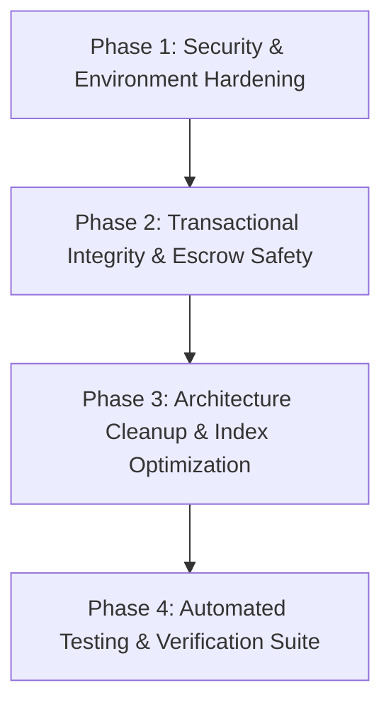

# SkillSwap — Milestone 1.0 Roadmap

## Milestone 1.0: Core Integrity, Security & Architecture Consolidation

---

### Phase 1: Security & Environment Hardening
**Goal**: Eliminate insecure secrets fallback, add boot-time environment validation, implement auth rate-limiting, and harden upload policies.
- **Requirements Covered**: `SEC-01`, `SEC-02`, `SEC-03`, `SEC-04`
- **Key Deliverables**:
  - Strict JWT secret checks in `backend/config/jwt.js`
  - Dedicated rate limiter on `/api/auth/login` and `/api/auth/register`
  - Clean environment validation on server startup in `backend/server.js`
  - MIME and file extension verification in upload middleware
- **Success Criteria**:
  - Missing `JWT_SECRET` aborts startup in production/dev.
  - Brute force attempts on auth routes receive 429 Too Many Requests.
  - Invalid file uploads rejected before hitting disk.

---

### Phase 2: Transactional Integrity & Escrow Safety
**Goal**: Guarantee ACID transaction guarantees across all wallet, booking, and credit lifecycle operations.
- **Requirements Covered**: `INT-01`, `INT-02`, `INT-03`, `INT-04`, `INT-05`
- **Key Deliverables**:
  - Refactored `bookingController.js` and `purchaseController.js` with MongoDB session transactions (`session.withTransaction`)
  - Atomic credit deduction and escrow hold on booking creation
  - Atomic escrow release on booking completion
  - Atomic refund to user balance upon cancellation
  - Concurrency tests demonstrating zero race conditions / negative balances
- **Success Criteria**:
  - Concurrent booking requests cannot overdraft wallet balance.
  - Partial transaction failures rollback all affected documents cleanly.

---

### Phase 3: Architecture Cleanup & Index Optimization
**Goal**: Remove orphaned files, reconcile duplicate schemas, and optimize database query indexing.
- **Requirements Covered**: `ARCH-01`, `ARCH-02`, `ARCH-03`, `ARCH-04`
- **Key Deliverables**:
  - Prune unused ESM files (`aiController.js`, `profileController.js`, `sessionController.js`, `messageController.js`, `errorMiddleware.js`)
  - Remove redundant models (`Profile.js`, `Session.js`)
  - Add compound indexes to `Booking` and `Skill` collections
  - Refactor unbounded queries in `adminController.js` with pagination
- **Success Criteria**:
  - 100% of backend codebase runs on standard CommonJS with no dangling ESM syntax.
  - Query execution plans on booking/skill filters utilize compound indexes.

---

### Phase 4: Automated Testing & Verification Suite
**Goal**: Establish comprehensive backend integration test coverage for authentication, wallet, and booking workflows.
- **Requirements Covered**: `TEST-01`, `TEST-02`, `TEST-03`, `TEST-04`, `TEST-05`
- **Key Deliverables**:
  - Jest + Supertest + `mongodb-memory-server` setup in `backend/tests/`
  - Auth test suite (`auth.test.js`)
  - Wallet & Escrow transaction test suite (`wallet.test.js`)
  - Booking lifecycle test suite (`booking.test.js`)
  - Configured `npm test` script in `backend/package.json`
- **Success Criteria**:
  - `npm test` executes all test suites and passes with 100% success rate.
  - All critical business paths (signup, login, credit deduction, booking completion, refund) are verified automatically.
