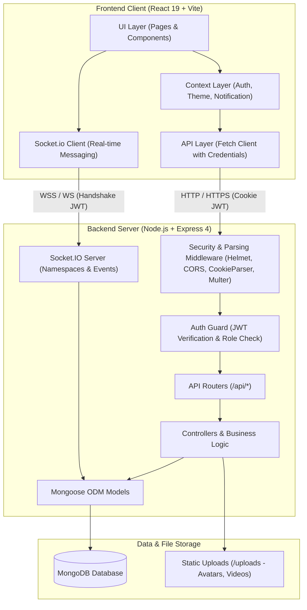
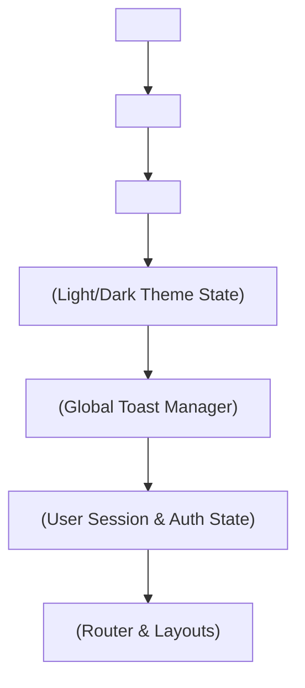
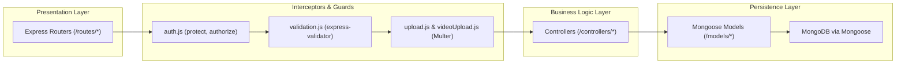
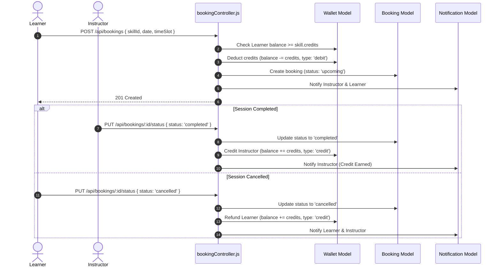
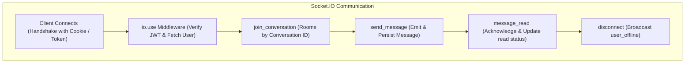

# SkillSwap System Architecture

## 1. High-Level Architecture Overview

SkillSwap is a full-stack peer-to-peer skill-sharing and course learning platform. It allows users to teach skills, attend 1-on-1 mentorship sessions, buy/sell pre-recorded video courses, participate in 1-on-1 course doubt sessions, and communicate in real-time.

The application follows a decoupled client-server architecture with a single-page React frontend communicating with an Express.js / Node.js backend over RESTful APIs and WebSocket (Socket.io) protocols, backed by MongoDB.



---

## 2. Frontend Architecture

The frontend is built with **React 19**, bundled via **Vite**, and routed using **React Router DOM v7**. It features a modern glassmorphic UI styled with custom CSS variables, `framer-motion` animations, and `lucide-react` icons.

### 2.1 State Management & Context Hierarchy

The frontend relies on lightweight, composable React Context providers rather than heavyweight state stores (e.g. Redux). Contexts are nested at the root level in [main.jsx](file:///c:/codes/SkillSwap/frontend/src/main.jsx#L11-L24):



- **[AuthContext](file:///c:/codes/SkillSwap/frontend/src/context/AuthContext.jsx)**: Manages active user identity, session initialization (`/api/auth/me`), login, registration, logout, and profile sync.
- **[NotificationContext](file:///c:/codes/SkillSwap/frontend/src/context/NotificationContext.jsx)**: Manages global alert toasts (success, error, info, achievement) with 4-second auto-dismissal.
- **[ThemeContext](file:///c:/codes/SkillSwap/frontend/src/context/ThemeContext.jsx)**: Controls light/dark theme preference persisted in local storage.

### 2.2 Routing & Layouts

Routing is defined in [App.jsx](file:///c:/codes/SkillSwap/frontend/src/App.jsx#L45-L82) with two primary layout wrappers:

1. **`PublicLayout`**: Accessible to unauthenticated visitors. Redirects logged-in users directly to `/dashboard`.
   - `/` (LandingPage)
   - `/login` (Login)
   - `/signup` / `/register` (Signup)
2. **`ProtectedRoute` + `AppLayout`**: Enforces user authentication before rendering the Navbar, container Outlet, and Footer.
   - `/dashboard` ([Home.jsx](file:///c:/codes/SkillSwap/frontend/src/pages/Home.jsx))
   - `/skills` / `/search` ([Search.jsx](file:///c:/codes/SkillSwap/frontend/src/pages/Search.jsx))
   - `/bookings` ([Bookings.jsx](file:///c:/codes/SkillSwap/frontend/src/pages/Bookings.jsx))
   - `/wallet` / `/credits` ([Credits.jsx](file:///c:/codes/SkillSwap/frontend/src/pages/Credits.jsx))
   - `/messages` ([Messages.jsx](file:///c:/codes/SkillSwap/frontend/src/pages/Messages.jsx))
   - `/profile` / `/profile-setup` ([ProfileSetup.jsx](file:///c:/codes/SkillSwap/frontend/src/pages/ProfileSetup.jsx))
   - `/u/:username` ([UserProfile.jsx](file:///c:/codes/SkillSwap/frontend/src/pages/UserProfile.jsx))
   - `/achievements` ([Achievements.jsx](file:///c:/codes/SkillSwap/frontend/src/pages/Achievements.jsx))
   - `/admin` ([AdminPanel.jsx](file:///c:/codes/SkillSwap/frontend/src/pages/AdminPanel.jsx))
   - `/my-courses` ([MyCourses.jsx](file:///c:/codes/SkillSwap/frontend/src/pages/MyCourses.jsx))
   - `/courses/:id/learn` ([CoursePlayer.jsx](file:///c:/codes/SkillSwap/frontend/src/pages/CoursePlayer.jsx))
   - `/teacher/studio` ([TeacherStudio.jsx](file:///c:/codes/SkillSwap/frontend/src/pages/TeacherStudio.jsx))
3. **Public Content Routes**: Static pages (`/about`, `/contact`, `/faq`, `/privacy`, `/terms`) and course public preview (`/courses/:id`).

### 2.3 API Client Layer

Frontend HTTP communications are centralized in [api.js](file:///c:/codes/SkillSwap/frontend/src/utils/api.js):
- Automatically resolves base URLs based on `VITE_API_URL` or defaults to `/api`.
- Enforces `credentials: 'include'` on all `fetch` requests to pass HTTP-only JWT cookies across origins.
- Intercepts non-2xx responses and standardizes error formats for context consumers.

---

## 3. Backend Architecture

The backend is built with **Node.js** and **Express.js**, following a classic layered MVC/Service pattern with Mongoose schemas for persistence.



### 3.1 Layered Responsibilities

- **Configuration Layer ([config/](file:///c:/codes/SkillSwap/backend/config))**:
  - `db.js`: MongoDB connection initialization with connection retry logs.
  - `jwt.js`: Token generation and signature verification with intelligent environment-aware cookie options (`httpOnly`, `sameSite`, `secure`).
- **Middleware Layer ([middleware/](file:///c:/codes/SkillSwap/backend/middleware))**:
  - `auth.js`: Authenticates requests by parsing tokens from HTTP cookies (`token`) or `Authorization: Bearer <token>` headers; enforces role-based access control (`authorize('admin')`).
  - `error.js`: Global error-handling middleware translating Mongoose CastError, duplicate key (11000), and validation errors into clear JSON responses.
  - `validation.js`: Declarative request payload validations using `express-validator`.
  - `upload.js` & `videoUpload.js`: Disk storage configurations for profile pictures and course video chunks using `multer`.
- **Controller Layer ([controllers/](file:///c:/codes/SkillSwap/backend/controllers))**: Handles request processing, input extraction, business rule validation, credit deductions/refunds, and HTTP response dispatching.
- **Model Layer ([models/](file:///c:/codes/SkillSwap/backend/models))**: Encapsulates data structure definitions, indexes, pre/post Mongoose hooks (e.g. password hashing, aggregate rating recalculations, field normalizations).

---

## 4. Key Workflows & Data Flows

### 4.1 Authentication & Session Lifecycle

```mermaid
sequenceDiagram
    autonumber
    actor User as Client (Browser)
    participant AuthCtrl as authController.js
    participant UserModel as User Model
    participant WalletModel as Wallet Model
    participant JWT as config/jwt.js

    User->>AuthCtrl: POST /api/auth/signup (username, email, password)
    AuthCtrl->>UserModel: findOne({ email or username })
    alt User Exists
        AuthCtrl-->>User: 400 Bad Request
    else New User
        AuthCtrl->>UserModel: create(user) [pre('save') hashes password]
        AuthCtrl->>WalletModel: create(wallet) [balance: 10 credits bonus]
        AuthCtrl->>JWT: generateToken(res, userId)
        JWT-->>User: Set-Cookie: token=<jwt>; HttpOnly; Path=/
        AuthCtrl-->>User: 201 Created (User Profile JSON)
    end
```

### 4.2 1-on-1 Skill Exchange & Credit Escrow Flow

The platform uses a double-entry style credit escrow mechanism for booking 1-on-1 skill mentorship sessions:



### 4.3 Course Publishing & Learning Flow

1. **Course Creation**: Teacher creates a course draft via `/api/courses` (`POST`).
2. **Video Curriculum**: Teacher uploads video modules via `/api/courses/:id/videos` (`POST` with multipart form data).
3. **Course Publishing**: Teacher marks course as published (`/api/courses/:id/publish`).
4. **Purchase Flow**: Learner purchases course (`/api/courses/:id/purchase`), deducting course credits from learner's wallet and crediting the teacher.
5. **Doubt Session**: Enrolled learner books 1-on-1 doubt session with the teacher (`/api/courses/:id/doubt-sessions`).

---

## 5. Real-Time & Asynchronous Communication

SkillSwap implements real-time messaging using **Socket.io** on the backend paired with HTTP REST polling fallback on the frontend.



- **Authentication via Handshake**: [server.js](file:///c:/codes/SkillSwap/backend/server.js#L47-L74) inspects `socket.handshake.headers.cookie` or `socket.handshake.auth.token`, decodes the user ID, and decorates the socket session.
- **Room Subscriptions**: Sockets join discrete rooms identified by `conversationId`.
- **Hybrid Support**: The backend supports full WebSocket messaging via [server.js](file:///c:/codes/SkillSwap/backend/server.js) as well as dedicated HTTP REST endpoints in [messageRoutes.js](file:///c:/codes/SkillSwap/backend/routes/messageRoutes.js) and [conversationRoutes.js](file:///c:/codes/SkillSwap/backend/routes/conversationRoutes.js) for robust offline synchronization and chat roster querying.
