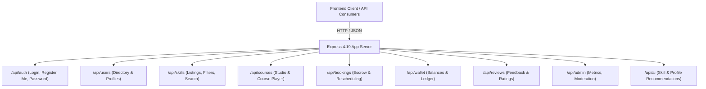

# External Integrations, APIs & Infrastructure Architecture

This document details all external services, third-party APIs, authentication providers, media storage mechanisms, container infrastructure, and internal communication protocols utilized in the **SkillSwap** codebase.

---

## 1. External APIs & Third-Party Services

| Service / Provider | Purpose | Usage in Codebase |
|:---|:---|:---|
| **DiceBear Avatars API** | Default dynamic avatar generator | Fallback avatar generation based on username seed (`https://api.dicebear.com/7.x/adventurer/svg?seed=<username>`) used in frontend message threads and user profile displays. |
| **Google Fonts CDN** | Typography assets | Loads the primary font family **Poppins** (`wght@300;400;500;600;700;800`) from `https://fonts.googleapis.com` and `https://fonts.gstatic.com`. |
| **jsDelivr CDN** | Static asset distribution | Included in Helmet Content Security Policy (CSP) directives to support external scripts and stylesheets if needed. |
| **Unsplash Asset CDN** | Preview images & mock attachments | Image mock previews referenced across skill mockups and chat simulation attachments (`https://images.unsplash.com/...`). |
| **Google Public DNS** | Atlas SRV record resolver | Configured in [`server.js`](file:///c:/codes/SkillSwap/backend/server.js#L1-L2) via `dns.setServers(["8.8.8.8", "8.8.4.4"])` to ensure resilient MongoDB Atlas DNS resolution across diverse OS network configurations. |

---

## 2. Authentication & Authorization

### 2.1 JWT-Based Dual-Transport Auth
The application implements JSON Web Token authentication supporting both modern cookie-based sessions and token header transport:
- **Issuance:** Tokens signed via `jsonwebtoken` with 30-day expiration in [`backend/config/jwt.js`](file:///c:/codes/SkillSwap/backend/config/jwt.js#L17-L25).
- **Transport A (HTTP-Only Cookie):** Stored in cookie named `token` with `httpOnly: true`, dynamic `sameSite` (`none` for cross-origin HTTPS, `lax` for localhost), and `secure` flags.
- **Transport B (Authorization Header):** `Authorization: Bearer <token>` header support for API consumers and testing tools.
- **Verification Middleware:** Handled centrally in [`backend/middleware/auth.js`](file:///c:/codes/SkillSwap/backend/middleware/auth.js#L5-L42), decoding token payload and resolving `req.user` without exposing password hashes.

### 2.2 Role-Based Access Control (RBAC)
- **Roles:** Defined in the User schema (`'user'`, `'admin'`).
- **Authorization Guard:** `authorize('admin')` middleware enforces route restrictions on administrative APIs under `/api/admin/*`.

---

## 3. Storage, Media & Asset Delivery

### 3.1 Local Disk Storage via Multer
- **Upload Pipeline:** Handled in [`backend/middleware/upload.js`](file:///c:/codes/SkillSwap/backend/middleware/upload.js).
- **Destination:** Stored locally in `backend/uploads/`.
- **Validation Rules:**
  - File format regex: `jpeg|jpg|png|webp|gif`.
  - Maximum upload file size: `5MB` (5 * 1024 * 1024 bytes).
  - Naming strategy: Unique timestamp hash prefix `avatar-<timestamp>-<random>.ext`.
- **Static Asset Serving:** Express exposes the directory statically at `/uploads` via `express.static(path.join(__dirname, 'uploads'))`.

### 3.2 SPA Build Artifact Serving
- Express serves compiled frontend assets from `frontend/dist` with automatic fallback to `frontend/dist/index.html` for single-page client routing.
- Legacy static frontend folder `frontend/` is retained as a fallback layer.

---

## 4. Infrastructure & Containerization

### 4.1 Backend Docker Container
- **Base Image:** `node:20-alpine` (lightweight, minimal attack surface).
- **Configuration:** [`backend/Dockerfile`](file:///c:/codes/SkillSwap/backend/Dockerfile)
  - Working Directory: `/usr/src/app`
  - Production Dependencies: `npm ci --only=production`
  - Exposed Port: `5000`
  - Command: `CMD ["npm", "start"]`

### 4.2 Multi-Service Docker Compose
- **Compose Specification:** Version `3.8` in [`docker-compose.yml`](file:///c:/codes/SkillSwap/docker-compose.yml).
- **Service Configuration:**
  - Service Name: `backend` (Container name: `skillswap-backend`).
  - Port Forwarding: `5000:5000`.
  - Environment Loading: Reads from `./backend/.env`.
  - Volumes:
    - Persistent media bind: `./backend/uploads:/usr/src/app/uploads`
    - Module isolation: `/usr/src/app/node_modules` volume prevents local host file overwrites.

---

## 5. Communication Protocols & API Architecture

### 5.1 REST API Endpoints

| Route Group | Base Endpoint | Description |
|:---|:---|:---|
| **Authentication** | [`/api/auth`](file:///c:/codes/SkillSwap/backend/routes/authRoutes.js) | Registration with 10 welcome credits, login, logout, profile fetch, password updates |
| **User Directory** | [`/api/users`](file:///c:/codes/SkillSwap/backend/routes/userRoutes.js) | Public user profiles, top mentor lists, profile searches |
| **Profile** | [`/api/profile`](file:///c:/codes/SkillSwap/backend/routes/profileRoutes.js) | Personal profile bio, skills offered, skills wanted, and avatar image uploads |
| **Skills** | [`/api/skills`](file:///c:/codes/SkillSwap/backend/routes/skillRoutes.js) | Skill marketplace listings, filtering by price/rating/category |
| **Courses** | [`/api/courses`](file:///c:/codes/SkillSwap/backend/routes/courseRoutes.js) | Teacher studio course creator, curricula, lessons, and draft management |
| **Bookings & Sessions** | [`/api/bookings`](file:///c:/codes/SkillSwap/backend/routes/bookingRoutes.js) & [`/api/sessions`](file:///c:/codes/SkillSwap/backend/routes/sessionRoutes.js) | Credit escrow reservation, approval, cancellation refund, time slots |
| **Wallet & Credits** | [`/api/wallet`](file:///c:/codes/SkillSwap/backend/routes/walletRoutes.js) | User token balances and debit/credit ledger records |
| **Notifications** | [`/api/notifications`](file:///c:/codes/SkillSwap/backend/routes/notificationRoutes.js) | Read/unread alerts for bookings, messages, and credit movements |
| **Reviews** | [`/api/reviews`](file:///c:/codes/SkillSwap/backend/routes/reviewRoutes.js) | 1-5 star ratings and post-save aggregate rating calculation |
| **AI Recommendations** | [`/api/ai`](file:///c:/codes/SkillSwap/backend/routes/aiRoutes.js) | Matching algorithm between `skillsWanted` and creator skill listings |
| **Admin Panel** | [`/api/admin`](file:///c:/codes/SkillSwap/backend/routes/adminRoutes.js) | System aggregate stats, circulating credit tally, user moderation |

### 5.2 Real-Time WebSocket Architecture (Socket.IO)

The real-time layer operates over Socket.IO (`/socket.io`) initialized in [`backend/server.js`](file:///c:/codes/SkillSwap/backend/server.js#L36-L157):

- **Socket Authentication Middleware:** Extracts and verifies JWT from handshake cookies or `auth.token`. Rejects unauthorized socket handshakes.
- **Presence Tracking:**
  - Server maintains an in-memory `onlineUsers` Map (`userId -> { socketId, lastSeen }`).
  - Broadcasts `user_online` and `user_offline` events on connect/disconnect.
- **Chat & Room Subscriptions:**
  - `join_conversation` / `leave_conversation`: Subscribes socket to conversation room ID.
  - `send_message`: Validates membership, persists message to MongoDB, updates conversation `lastMessageAt`, and emits `receive_message` to the room.
  - `message_read`: Bulk updates unread messages and sends `message_read_ack` to active participants.
